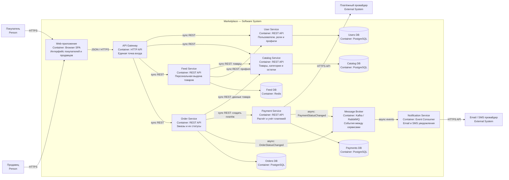

# Архитектура маркетплейса

Учебный проект по архитектурному проектированию маркетплейса. В репозитории нет бизнес-логики: здесь есть C4 Container-диаграмма, описание архитектурных решений и минимальный сервис каталога с health-check.

## 1. Что должна уметь система

Маркетплейс позволяет продавцам управлять товарами, а покупателям смотреть персональную ленту и оформлять заказы. Отдельно учитываются платежи и отправляются уведомления о статусе заказа.

Основные пользователи:

- покупатель — смотрит ленту и оформляет заказ;
- продавец — добавляет и изменяет товары;
- администратор — следит за пользователями и каталогом.

## 2. C4 Container-диаграмма

Ниже показан уровень **Container** модели C4. Контейнер здесь — отдельное приложение или хранилище с собственной ответственностью, а не обязательно Docker-контейнер.



Пользовательские запросы идут синхронно по HTTP через API Gateway. Уведомления не должны замедлять оформление заказа, поэтому для них используются асинхронные события через брокер сообщений.

## 3. Домены и ответственность

| Домен | Сервис | Ответственность | Данные, которыми владеет |
|---|---|---|---|
| Пользователи | User Service | Регистрация, профиль, роли покупателя и продавца | Пользователи, профили, роли |
| Каталог | Catalog Service | Карточки товаров, категории, цены и остатки | Товары, категории, цены, остатки |
| Лента | Feed Service | Подбор и порядок товаров для пользователя | Кэш ленты, признаки и история рекомендаций |
| Заказы | Order Service | Создание заказа и изменение его статуса | Заказы, позиции заказа, история статусов |
| Платежи | Payment Service | Расчёт суммы, создание и учёт платежа | Платежи, суммы, статусы и идентификаторы провайдера |
| Уведомления | Notification Service | Отправка сообщений о статусах заказа и платежа | Шаблоны и история отправки |

Границы выбраны по бизнес-ответственности. У каждого сервиса своё хранилище: общей базы данных нет. Другой сервис не читает чужую БД напрямую, а обращается к владельцу данных через API или получает событие.

## 4. Взаимодействие сервисов

Синхронные вызовы применяются, когда ответ нужен сразу:

- Web-приложение → API Gateway → нужный сервис — REST/JSON;
- Feed Service → Catalog Service и User Service — получение товаров и простых признаков пользователя;
- Order Service → Catalog Service — проверка товара и получение актуальной цены;
- Order Service → Payment Service — создание платежа;
- Payment Service → внешний платёжный провайдер — HTTPS API.

Асинхронные вызовы применяются для действий, которые можно выполнить позже:

- Order Service публикует `OrderStatusChanged`;
- Payment Service публикует `PaymentStatusChanged`;
- Notification Service получает события и отправляет email или SMS.

Персонализация ленты сделана простой: Feed Service использует категории недавно просмотренных товаров пользователя и популярность товаров. Для учебного проекта этого достаточно; позже алгоритм можно заменить, не меняя Catalog Service.

## 5. Варианты декомпозиции

### Вариант A — модульный монолит

Все домены находятся в одном приложении, но разделены на модули.

Плюсы:

- проще запустить и разрабатывать небольшой командой;
- один деплой и меньше инфраструктуры;
- проще выполнять транзакции между заказом и оплатой.

Минусы:

- нельзя независимо масштабировать ленту или каталог;
- ошибка одного модуля может остановить всё приложение;
- со временем границы модулей легко нарушить общей базой.

### Вариант B — сервисы по бизнес-доменам

User, Catalog, Feed, Order, Payment и Notification работают как отдельные сервисы и владеют своими данными.

Плюсы:

- понятные границы ответственности и владения данными;
- сервисы можно независимо развивать и масштабировать;
- сбой уведомлений не блокирует оформление заказа;
- алгоритм персонализации можно менять отдельно.

Минусы:

- сложнее локальный запуск и эксплуатация;
- нужны API-контракты, брокер сообщений и наблюдаемость;
- операции между сервисами не имеют одной общей транзакции;
- возможна временная несогласованность данных.

### Финальный выбор

Для целевой архитектуры выбран **вариант B — сервисы по бизнес-доменам**. В условиях задания уже есть разные по нагрузке и ответственности части: каталог, персональная лента, заказы, платежи и уведомления. Разделение позволяет масштабировать ленту и каталог отдельно, изолировать работу с платёжным провайдером и отправлять уведомления асинхронно.

Для настоящего небольшого стартапа я бы начал с модульного монолита, потому что он дешевле. Но в этой работе сервисный вариант лучше показывает границы доменов, владение данными и способы взаимодействия, которые требуются в критериях.

## 6. Реализованный сервис

В коде поднят минимальный `Catalog Service`. Бизнес-логики в нём нет. Он нужен только для демонстрации запуска приложения и health-check.

Endpoint:

```text
GET /health
```

Успешный ответ:

```json
{
  "status": "ok",
  "service": "catalog-service"
}
```

HTTP-статус ответа — `200 OK`.

## 7. Запуск

### Через Docker Compose

```bash
docker compose up --build -d
curl -i http://localhost:8080/health
```

Остановка:

```bash
docker compose down
```

### Через Docker

```bash
docker build -t marketplace-catalog .
docker run --rm -p 8080:8080 marketplace-catalog
```

В другом терминале:

```bash
curl -i http://localhost:8080/health
```

### Без Docker

Нужен Python 3.12 или новее.

```bash
python3 app.py
```

Сервис будет доступен на `http://localhost:8080`.

## 8. Проверка

Автоматический тест:

```bash
python3 -m unittest discover -s tests -v
```

Проверка Compose-конфигурации:

```bash
docker compose config
```

## 9. Принятые архитектурные решения

1. **Database per service.** Каждый сервис сам владеет своими данными. Это сохраняет границы доменов и убирает общую БД.
2. **REST для запросов с немедленным ответом.** Такой способ проще понять, проверить и отладить в учебном проекте.
3. **События для уведомлений.** Заказ не должен ждать, пока внешний email- или SMS-провайдер отправит сообщение.
4. **Отдельный Feed Service.** Персональная выдача имеет свою логику и нагрузку, поэтому её можно развивать независимо от каталога.
5. **Минимальный сервис без фреймворка.** Для health-check достаточно стандартной библиотеки Python: меньше зависимостей и проще Docker-образ.

## Структура репозитория

```text
.
├── app.py
├── architecture
│   └── c4-container.mmd
├── tests
│   └── test_app.py
├── Dockerfile
├── docker-compose.yml
└── README.md
```
