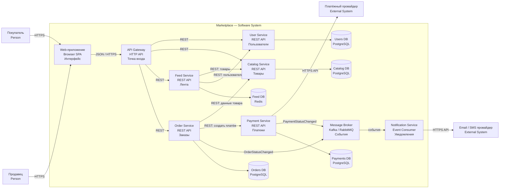

# Архитектура маркетплейса

Это учебная работа по проектированию маркетплейса. Я сделал C4 Container-диаграмму, описал основные сервисы и поднял один простой сервис в Docker.

Бизнес-логики здесь нет, потому что по заданию на этом этапе она не нужна. Реализован только endpoint `/health`, чтобы проверить, что сервис работает.

## 1. Что есть в маркетплейсе

В системе есть два основных типа пользователей:

- покупатель смотрит товары и делает заказы;
- продавец добавляет товары и управляет ими.

Маркетплейс должен уметь показывать персональную ленту, хранить каталог, оформлять заказы, учитывать платежи и отправлять уведомления.

## 2. C4 Container-диаграмма

На диаграмме показаны основные сервисы, базы данных и связи между ними. В C4 контейнер - это отдельное приложение или хранилище, а не только Docker-контейнер.



Покупатель и продавец работают через веб-приложение. Запрос сначала попадает в API Gateway, а он уже отправляет его нужному сервису.

## 3. Домены и ответственность

Я разделил систему на следующие домены:

| Домен | Сервис | За что отвечает | Какие данные хранит |
|---|---|---|---|
| Пользователи | User Service | Профили и роли покупателей и продавцов | Пользователи, профили, роли |
| Каталог | Catalog Service | Товары, категории, цены и остатки | Карточки товаров, категории, цены |
| Лента | Feed Service | Порядок товаров для конкретного пользователя | Кэш ленты и данные для рекомендаций |
| Заказы | Order Service | Создание заказа и его статусы | Заказы, позиции и история статусов |
| Платежи | Payment Service | Создание и учёт платежей | Суммы, статусы и ID платежей |
| Уведомления | Notification Service | Отправка email и SMS | Шаблоны и история отправки |

У каждого сервиса своя база. Общей базы на все сервисы нет. Если одному сервису нужны чужие данные, он получает их через API или событие, а не читает чужую базу напрямую.

## 4. Как сервисы общаются

Есть два вида взаимодействия.

**Синхронное взаимодействие** используется, когда ответ нужен сразу. Например, Order Service обращается в Catalog Service, чтобы получить информацию о товаре, а затем в Payment Service, чтобы создать платёж. Для этого используется REST по HTTP.

**Асинхронное взаимодействие** используется для уведомлений. Order Service и Payment Service отправляют события в брокер сообщений. Notification Service читает эти события и отправляет email или SMS. Поэтому заказ не будет ждать, пока отправится письмо.

Для персонализации ленты я выбрал простой вариант: показывать больше товаров из недавно просмотренных категорий и учитывать популярные товары. Сам алгоритм в этой работе не реализован, он только описан в архитектуре.

## 5. Варианты архитектуры

Я рассмотрел два варианта.

### Вариант 1 - модульный монолит

Все части маркетплейса находятся в одном приложении, но разделены на модули.

Плюсы:

- проще разрабатывать и запускать;
- нужен только один деплой;
- меньше инфраструктуры.

Минусы:

- нельзя отдельно масштабировать каталог или ленту;
- ошибка может повлиять на всё приложение;
- модули со временем могут слишком сильно связаться друг с другом.

### Вариант 2 - отдельные сервисы

Каждый домен находится в своём сервисе и хранит свои данные.

Плюсы:

- у сервисов понятные обязанности;
- их можно масштабировать отдельно;
- проблема с уведомлениями не остановит работу заказов;
- ленту можно менять независимо от каталога.

Минусы:

- сложнее запуск и поддержка;
- нужно настраивать взаимодействие между сервисами;
- появляется брокер сообщений;
- данные в разных сервисах могут обновляться не одновременно.

### Что я выбрал

Для этой работы я выбрал второй вариант - отдельные сервисы по доменам. У каталога, ленты, заказов и платежей разная ответственность и разная нагрузка. Например, ленту могут открывать намного чаще, чем оформлять заказы, поэтому её удобно масштабировать отдельно.

Если бы это был маленький проект для первой версии продукта, я бы, скорее всего, начал с модульного монолита. Но для данного задания вариант с сервисами лучше показывает границы доменов, владение данными и разные способы взаимодействия.

## 6. Реализованный сервис

В проекте поднят простой `Catalog Service`. Пока в нём нет работы с товарами - только технический health-check:

```text
GET /health
```

Ответ:

```json
{
  "status": "ok",
  "service": "catalog-service"
}
```

Статус ответа - `200 OK`.

Если обратиться по неизвестному адресу, сервис вернёт `404 Not Found`.

## 7. Запуск

Запуск через Docker Compose:

```bash
docker compose up --build -d
```

Проверка:

```bash
curl -i http://localhost:8080/health
```

Остановка:

```bash
docker compose down
```

Также сервис можно запустить без Docker. Для этого нужен Python 3.12:

```bash
python3 app.py
```

## 8. Тесты

Запуск тестов:

```bash
python3 -m unittest discover -s tests -v
```

Есть два простых теста:

- `/health` возвращает статус `200` и правильный JSON;
- неизвестный адрес возвращает `404`.

Тестов бизнес-логики нет, потому что по заданию бизнес-логику реализовывать не нужно.

## 9. Основные решения

- Каждый сервис владеет своей базой данных.
- REST используется там, где ответ нужен сразу.
- Брокер сообщений используется для событий и уведомлений.
- Персональная лента вынесена отдельно от каталога.
- Для примера реализован Catalog Service на стандартной библиотеке Python без дополнительных зависимостей.

## Структура проекта

```text
.
├── app.py
├── architecture
│   └── c4-container.mmd
├── tests
│   └── test_app.py
├── Dockerfile
├── docker-compose.yml
└── README.md
```
